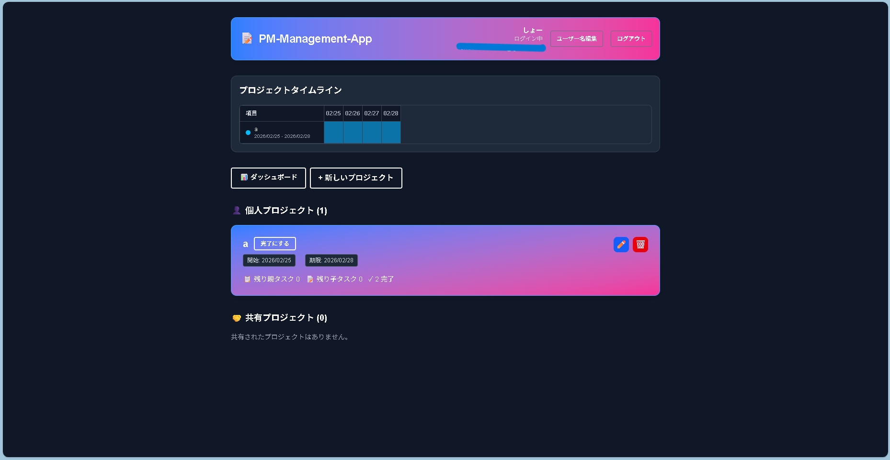
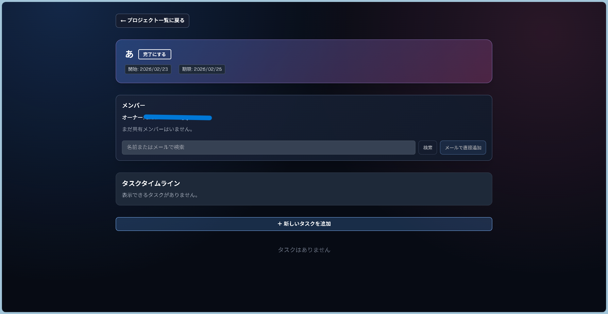
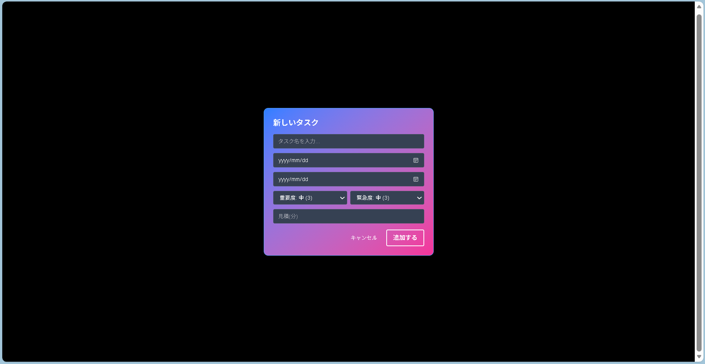
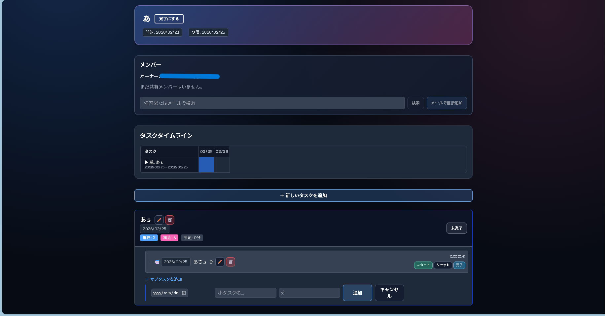
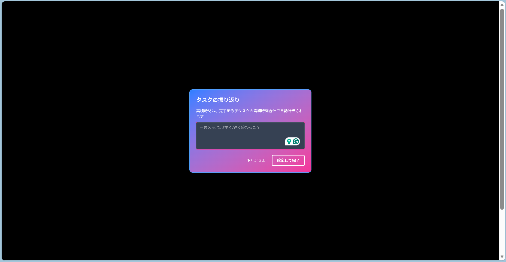
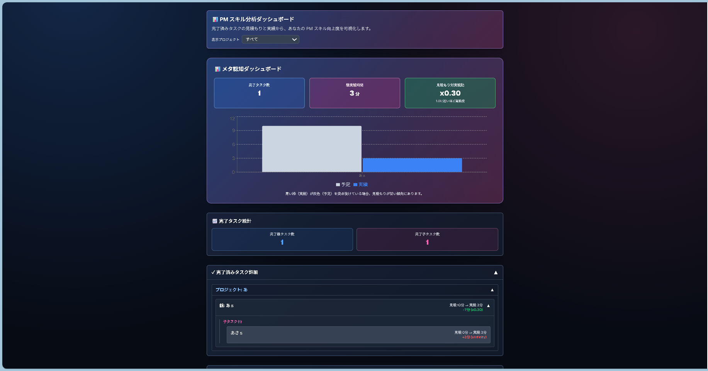
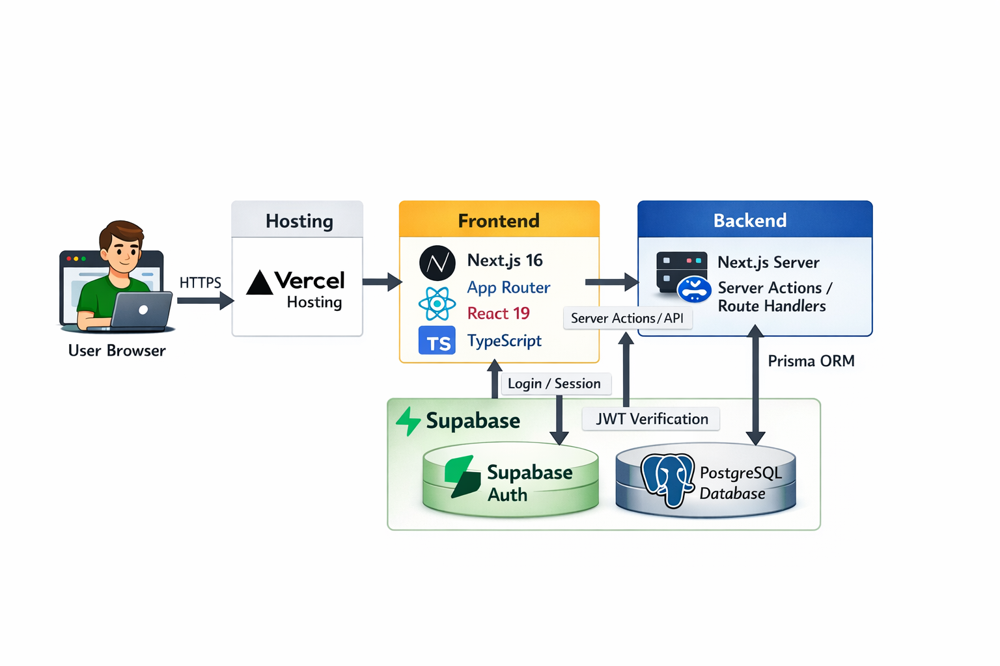

# PM Management App - プロジェクト＆タスク管理ツール

<p align="center">
  
  
  
  
  
  
  
  
  
</p>

## 目次

- [概要](#概要)
- [公開 URL](#公開-url)
- [特徴と機能](#特徴と機能)
  - [1. マルチユーザー対応プロジェクト管理](#1-マルチユーザー対応プロジェクト管理)
  - [2. タスク作成時の記録項目](#2-タスク作成時の記録項目)
  - [3. 完了時の振り返り機能](#3-完了時の振り返り機能)
  - [4. タイムラインチャート＋進捗ダッシュボード](#4-タイムラインチャート進捗ダッシュボード)
  - [5. タスクの親子関係管理（WBS）](#5-タスクの親子関係管理wbs)
  - [6. タスク依存関係（ガントチャート）](#6-タスク依存関係ガントチャート)
  - [7. 優先度マトリクス（アイゼンハワー）](#7-優先度マトリクスアイゼンハワー)
  - [8. ブロッカー・リスク管理](#8-ブロッカーリスク管理)
  - [9. タスクコメント](#9-タスクコメント)
  - [10. 通知システム（Web Push / Slack）](#10-通知システムweb-push--slack)
  - [11. CSV エクスポート](#11-csv-エクスポート)
  - [12. ゲストモード](#12-ゲストモード)
- [使用技術（技術スタック）](#使用技術技術スタック)
- [API エンドポイント](#api-エンドポイント)
- [開発期間・体制](#開発期間体制)
- [工夫した点・苦労した点](#工夫した点苦労した点)
- [既知の課題と今後の展望](#既知の課題と今後の展望)
- [セットアップ・実行手順](#セットアップ実行手順)
- [ライセンス](#ライセンス)
- [連絡先](#連絡先)

---

## 概要

**PM Management App** は、プロジェクト管理とタスク実行ログ（見積/実績・振り返り）を一体化した Web アプリケーションです。

単なる ToDo 管理ではなく、以下を重視しています。

- **プロジェクト・タスク管理**：親子タスク（WBS）で構造化
- **予実管理**：見積時間と実績時間の差分を可視化
- **振り返り**：完了時にメモを残して改善サイクルを回す
- **チーム共有**：オーナーがメンバー追加/削除
- **可視化**：タイムライン・ダッシュボードで進捗確認
- **通知**：Web Push と Slack で期限・アサインをリアルタイム通知
- **分析**：アイゼンハワー・ガントチャート・クリティカルパスで意思決定を支援

### 開発の背景・経緯

「タスクを終わらせる」だけでなく、「次回の見積精度を上げる」ための実行ログを残すことを目的に開発しています。  
見積と実績、振り返りを一連で記録し、継続的な改善につなげる設計です。

### 公開 URL

https://pm-management-app.vercel.app/

---

## 特徴と機能

### 1. **マルチユーザー対応プロジェクト管理**

- 自分が作成したプロジェクト + 共有されたプロジェクトを表示
- オーナーはメンバーの追加/削除が可能
- メンバーにも閲覧・操作権限を付与
- プロジェクトのアーカイブ・アーカイブ解除に対応

<p align="center"></p>
<p align="center"><sub>図1. ホーム画面（プロジェクト一覧）</sub></p>

<p align="center"></p>
<p align="center"><sub>図2. プロジェクト詳細（タスク管理）</sub></p>

### 2. **タスク作成時の記録項目**

- タイトル
- 開始日・期限日
- 重要度・緊急度（1〜5）
- 見積時間（分）
- 親タスク配下への子タスク追加
- 担当者アサイン

<p align="center"></p>
<p align="center"><sub>図3. 親タスク作成フォーム</sub></p>

<p align="center"></p>
<p align="center"><sub>図4. サブタスク作成フォーム</sub></p>

### 3. **完了時の振り返り機能**

- 実績時間を記録
- 振り返りメモを記録
- 親タスク完了時は、完了済み子タスクの実績合計を自動反映
- 子タスクはタイマー（スタート/ストップ/リセット）で実績時間を記録
- 完了後でも実績時間の修正が可能

<p align="center"></p>
<p align="center"><sub>図5. タスク完了時の振り返り入力</sub></p>

### 4. **タイムラインチャート＋進捗ダッシュボード**

- ホーム：プロジェクトタイムライン、期限が近いタスクを表示
- ダッシュボード：プロジェクト別フィルタ、完了タスク統計、見積/実績比較
- 完了済みタスクの詳細を `プロジェクト → 親 → 子` で確認
- 見積もり対実績比（x1.0 が理想）で PM スキルを可視化

<p align="center"></p>
<p align="center"><sub>図6. ダッシュボード（見積/実績の可視化）</sub></p>

### 5. **タスクの親子関係管理（WBS）**

- 親タスク・子タスクを同一画面で管理
- 子タスクにはタイマー機能あり
- 状態は `TODO / IN_PROGRESS / BLOCKED / DONE`
- 完了済み子タスクの実績時間が親タスクに自動集約

<p align="center"></p>
<p align="center"><sub>図7. 親子タスク（WBS）構成の表示</sub></p>

### 6. **タスク依存関係（ガントチャート）**

- 先行タスク（Predecessor）と後続タスク（Dependent）の依存関係を設定
- 依存関係の種類：`FINISH_TO_START`（標準）、`START_TO_START`、`FINISH_TO_FINISH`
- ガントチャートでタスクの期間と依存関係を可視化
- クリティカルパス（最長経路）を赤色でハイライト表示

### 7. **優先度マトリクス（アイゼンハワー）**

- 重要度 × 緊急度でタスクを 4 象限に分類
- 第1象限（重要×緊急）、第2象限（重要×非緊急）、第3象限（非重要×緊急）、第4象限（非重要×非緊急）
- 未完了タスクのみ表示（完了済みは除外）

### 8. **ブロッカー・リスク管理**

- タスクにブロッカー（阻害要因）を報告
- 深刻度：`LOW` / `MEDIUM` / `HIGH` / `CRITICAL`
- ブロック中のタスクはステータス変更を制限
- ダッシュボードでアクティブなブロッカーを一覧表示

### 9. **タスクコメント**

- タスクごとにコメントスレッドを作成
- Ctrl + Enter でコメント送信
- コメント数をバッジ表示

### 10. **通知システム（Web Push / Slack）**

- **Web Push 通知**：ブラウザのプッシュ通知 API でリアルタイム通知
- **Slack 連携**：Webhook URL を設定して Slack に通知
- **通知種類**：
  - 期限1週間前 / 1日前 / 30分前
  - 期限超過直後
  - タスクアサイン
  - タスクステータス変更
- **通知設定**：
  - 各種類ごとに ON/OFF 切り替え
  - 静音時間（Quiet Hours）設定
  - タイムゾーン設定
- **通知ディスパッチ**：Cron ジョブから `POST /api/notifications/dispatch` を定期実行

### 11. **CSV エクスポート**

- プロジェクト内のタスクを CSV 形式でダウンロード
- エクスポート項目：ID、タスク名、ステータス、担当者、期限、見積時間、実績時間、自信度、満足度、振り返り

### 12. **ゲストモード**

- ログインなしでアプリを体験可能
- データはブラウザを閉じると消えます

---

## 使用技術（技術スタック）

### フロントエンド

- TypeScript 5
- Next.js 16.1.6 (App Router)
- React 19
- Tailwind CSS 4
- Recharts
- React Compiler

<p align="left">
  
</p>

### バックエンド・データベース

- Prisma ORM
- PostgreSQL（Supabase / Neon）

<p align="left">
  
</p>

### 認証・セキュリティ

- Better Auth（メール/パスワード認証）
- Prisma Adapter
- Next.js Cookies プラグイン

### 通知・外部サービス

- Web Push（VAPID キー認証）
- Slack Webhook
- Service Worker

### 開発・デプロイ

- VS Code
- ESLint
- Vercel

<p align="left">
  
</p>

### システム構成図

<p align="center"></p>
<p align="center"><sub>図8. システム構成図</sub></p>

---

## API エンドポイント

| メソッド | パス | 説明 | 認証 |
|---------|------|------|------|
| GET/POST | `/api/auth/[...all]` | Better Auth 認証エンドポイント | 不要 |
| GET | `/api/users/resolve-email?username=` | ユーザー名からメールアドレスを解決 | 不要 |
| GET/POST/PUT | `/api/projects/actions` | プロジェクト CRUD | 必要 |
| GET | `/api/projects/[id]/export` | プロジェクトタスクを CSV エクスポート | 必要 |
| POST | `/api/notifications/dispatch` | 通知ディスパッチ（Cron 用） | 秘密鍵 |
| POST | `/api/notifications/events/enqueue` | 通知イベント手動登録 | 秘密鍵 |
| GET/POST/PUT | `/api/notifications/preferences` | 通知設定取得/更新 | 必要 |
| GET/POST/DELETE | `/api/notifications/subscriptions` | Web Push 購読管理 | 必要 |
| POST | `/api/notifications/test` | テスト通知登録 | 必要 |
| POST | `/api/child-tasks/actions` | 子タスク操作 | 必要 |
| POST | `/api/parent-tasks/actions` | 親タスク操作 | 必要 |

---

## 開発期間・体制

- 開発体制：個人開発
- 開発期間：2026/1/30 - 2026/2/19（70時間以上）

---

## 工夫した点・苦労した点

### 工夫した点

1. **親子タスクの自己参照設計（WBS）**：Prisma の自己参照リレーションで階層構造を実現
2. **見積/実績/振り返りを完了フローに統合**：完了時に実績時間と振り返りを同時に記録
3. **オーナー/メンバーの権限分離**：プロジェクトアクセス制御を中央集権的に管理
4. **完了タスクをプロジェクト詳細内で継続して確認できる構成**：完了済みタスクを折りたたみ可能に表示
5. **タスク依存関係とクリティカルパス**：ガントチャートで依存関係とクリティカルパスを可視化
6. **アイゼンハワー・マトリクス**：重要度×緊急度でタスクを 4 象限に分類
7. **ブロッカー・リスク管理**：タスクにブロッカーを報告し、ダッシュボードで一覧表示
8. **Web Push + Slack 二重通知**：ブラウザ通知と Slack の両方に対応
9. **子タスクタイマー**：ローカルストレージにタイマー状態を保持し、完了時に実績時間を自動計算
10. **CSV エクスポート**：プロジェクトデータを簡単に外部に出力可能

### 苦労した点

1. **Prisma スキーマ更新時の Client 不整合への対応**：`prisma generate` のタイミングとマイグレーションの同期
2. **SSR と認証状態の同期**：Better Auth のセッションをサーバー側で確実に取得
3. **操作ボタンを維持しつつ、カード全体クリック導線を両立**：`pointer-events` と `z-index` で解決
4. **子タスクタイマーの状態管理**：ローカルストレージと React 状態の同期、完了時の自動集約
5. **通知の重複防止**：`dedupeKey` で同じ通知の重複登録を防止
6. **ガントチャートのクリティカルパス計算**：DFS で最長経路を計算し、SVG で描画

---

## 既知の課題と今後の展望

### 既知の課題

1. UIの統一感・情報密度の最適化
2. 大規模データ時の描画/集計パフォーマンス
3. 履歴データのアーカイブ戦略（将来的に必要なら別途導入）
4. 子タスクタイマーはブラウザタブを閉じるとリセットされる（ローカルストレージ依存）

### 今後の展望 & ロードマップ

- 通知連携（Slack / メール）
- 分析指標の拡充（週次・月次比較）
- エクスポート機能（CSV）
- ガントチャートの印刷/画像出力
- モバイルアプリ（PWA 強化）

---

## セットアップ・実行手順

### 環境構築

```bash
npm install
```

`.env` に以下を設定してください。

```env
# データベース
DATABASE_URL=
DIRECT_URL=

# Better Auth
BETTER_AUTH_SECRET=
NEXT_PUBLIC_APP_URL=http://localhost:3000

# Web Push（通知機能）
WEB_PUSH_VAPID_PUBLIC_KEY=
WEB_PUSH_VAPID_PRIVATE_KEY=
NEXT_PUBLIC_WEB_PUSH_VAPID_PUBLIC_KEY=
WEB_PUSH_SUBJECT=mailto:admin@example.com

# 通知ディスパッチ認証（Cron 用秘密鍵）
NOTIFICATION_CRON_SECRET=
```

> **注**：`DIRECT_URL` は Prisma のマイグレーション用で、`DATABASE_URL` はランタイム用です。Supabase を使用する場合はそれぞれの URL を設定してください。

### データベースのマイグレーション

```bash
npx prisma migrate dev
npx prisma generate
```

### 開発サーバーの起動

```bash
npm run dev
```

### 通知ディスパッチの設定

通知ディスパッチは Cron などから以下を定期実行してください。

```bash
curl -X POST "http://localhost:3000/api/notifications/dispatch" \
  -H "x-notification-secret: ${NOTIFICATION_CRON_SECRET}"
```

通知イベント（タスク期限系）は以下を自動登録します。

- 期限の1週間前
- 期限の1日前
- 期限の30分前
- 期限超過直後

### 本番ビルド

```bash
npm run build
npm run start
```

---

## ライセンス

MIT License（`LICENSE`）

---

## 連絡先

- 開発者：show151
- Repository：https://github.com/show151/pm-management-app
